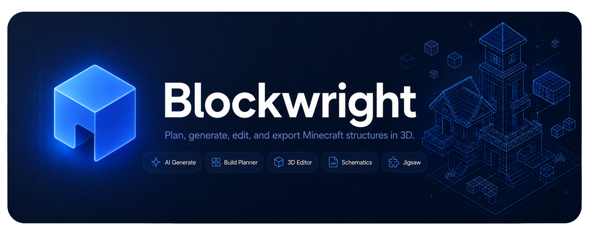
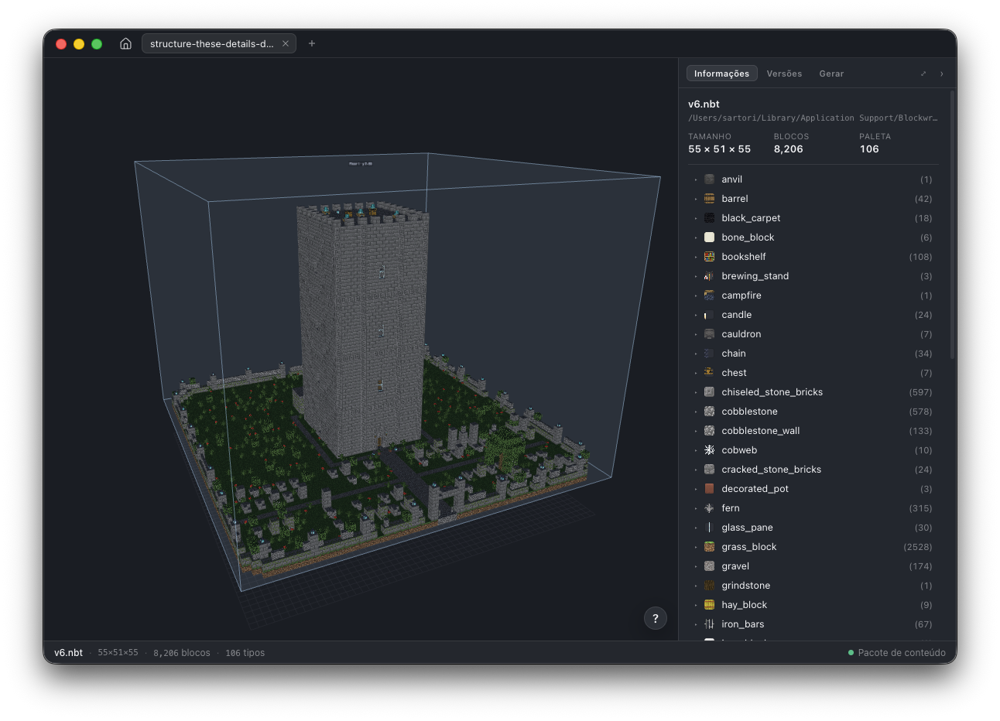
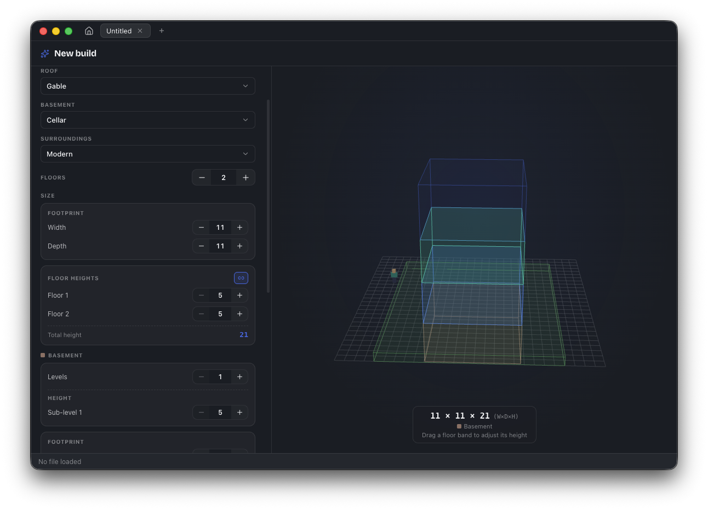

<p align="center">
  
</p>

<h1 align="center">Blockwright</h1>

<p align="center">
  A desktop app for viewing, browsing, and AI-generating Minecraft <code>.nbt</code> structures in 3D.
</p>

<p align="center">
  <a href="https://www.electronjs.org"></a>
  <a href="https://threejs.org"></a>
  <a href="https://www.typescriptlang.org"></a>
  <a href="./LICENSE"></a>
  <a href="https://buymeacoffee.com/mattsartori"></a>
</p>

<p align="center">
  <a href="#overview">Overview</a> ·
  <a href="#features">Features</a> ·
  <a href="#usage">Usage</a> ·
  <a href="#mod-workspaces">Mod Workspaces</a> ·
  <a href="#development">Development</a> ·
  <a href="#architecture">Architecture</a> ·
  <a href="#support">Support</a>
</p>

<p align="center">
  
</p>

<p align="center">
  
</p>

## Overview

Blockwright is an Electron desktop app that loads Minecraft `.nbt` structure files and renders
them as interactive 3D scenes. Block models and textures are read from an extracted Minecraft
"content pack" on disk, so structures appear with their real in-game look — including support for
modded blocks via [mod workspaces](#mod-workspaces).

Blockwright can also **AI-generate** structures: describe a build in a prompt (optionally with a
reference image) and the model emits a structure, which the app compiles to `.nbt`, renders, and
refines through an emit → render → review loop — previewed live in the viewer as it evolves.

## Features

- Real-time 3D rendering of `.nbt` structures with [Three.js](https://threejs.org)
- AI structure generation from a prompt or reference image, through an emit → render → review loop
  that refines the build live — on your existing **Claude** (Pro/Max) or **Codex** (ChatGPT
  Plus/Pro) subscription, no API credits; with simple cost presets (Saver / Balanced / Thorough)
  to trade quality for spend, configured in Settings ▸ AI
- Composable generation domain — pick a structure type (a **House** — classic / modern / farmhouse /
  sakura / gothic — or a **Tower** — a battlemented stone keep; each compiles a code-built shell with
  seeded run-to-run variety that the AI furnishes and details, so the silhouette is guaranteed), a
  decoration (including a universal dressed-stone **castle** look), a roof, a basement, an in-roof
  attic, the surroundings (a code-built yard
  laid outside the building shell: a fenced **cottage garden** — stone-and-fence
  perimeter with a varied outline, lamp posts, a double-door gate, dirt paths, flower beds, crop
  plots and a well or fountain — a **pool terrace**, or a fenced **graveyard**) and per-floor interior rooms — a
  general family (living room, kitchen, library, bedroom, shared bedrooms, storage) and a horror family
  (ritual chamber, dungeon, morgue, séance parlour) — in the full-stage Build Planner (browse
  every part with live 3D previews in the Module Gallery); the selection guides the build and loads
  only the relevant knowledge, and registered structure × decoration modules also cross at compile
  time behind the `template` op. Each room scales its furnishing to the floor via space-tiered
  **furnishing presets** (snug / standard / grand) that the chosen decoration re-skins — so a big room
  is furnished to its size instead of coming out empty (browse a room's presets in the Module Gallery)
- In-app **block editor** — edit a structure directly in the 3D viewer: click to select (Shift-click
  for a box), move and extrude the selection (raise a footprint into walls), **mirror and rotate** it,
  build facing-correct stairs, place, replace and delete blocks, with real undo/redo and arrow-key
  nudging. Orientation stays correct on every transform — mirror a wing and its stairs/logs/doors flip
  the right way (the bug WorldEdit never fully fixed) — and **Save version** writes the edit as a new
  `.nbt` version, so a mistake is never fatal
- **Schematic interop** — open **WorldEdit `.schem`** (Sponge) and **Litematica `.litematic`** schematics
  directly: they decode, render, and edit exactly like a native `.nbt`, and **Export As…** writes any of
  the three formats (block entities like chest contents and sign text are preserved through the conversion)
  — so a schematic can be brought in, tweaked, and saved back out (or converted to a mod-ready `.nbt`)
- Floor-plan editing — define named vertical levels, highlighted as bands in the viewer, that ride
  along as context on every generation prompt
- A browsable structure library — each generated build is saved to its own folder (the latest clean
  `.nbt`, every kept version, and a generation log), revealed from the chat's build card
- Namespace-aware asset resolution from your own extracted Minecraft content pack (configurable;
  not bundled)
- Mod workspace support — render modded structures with their own textures and models, with the
  workspace's target Minecraft version auto-detected, and **export** a structure into a workspace as a
  version-correct `.nbt` plus the worldgen JSON (jigsaw structure / template pool / structure set /
  biome tag) that makes it spawn in-world — reading the mod's own biomes and validating it before writing
- Jigsaw assembly preview for worldgen template pools
- Block Catalog browser with live 3D block previews
- Block-entity rendering (chests, beds, banners, skulls, decorated pots) and animated fluids
  (water / lava)
- Deterministic color fallback for blocks with missing textures
- Floating, dockable tool windows (Controls / Inspector / Jigsaw) and a light/dark themed UI
- Recently opened files and workspaces, surfaced in the welcome screen and native menu
- Headless self-screenshot for visual testing (no screen-recording permission needed)
- Full TypeScript source across all three Electron contexts

## Usage

> **Downloads** — packaged installers (macOS `.dmg`/`.zip`, Windows `.exe`, Linux `.deb`/`.rpm`)
> are attached to each [GitHub Release](https://github.com/matheussartori/blockwright/releases).
> Builds are **ad-hoc signed, not notarized** (no paid Apple Developer cert yet), so the first
> launch shows an OS warning:
>
> - **macOS** — right-click the app ▸ **Open**, then **Open** in the dialog (or System Settings ▸
>   Privacy & Security ▸ *Open Anyway*). If macOS instead says the app **"is damaged and can't be
>   opened"**, Gatekeeper is blocking the quarantined download — clear the quarantine flag and open
>   it normally:
>   ```bash
>   xattr -dr com.apple.quarantine /Applications/Blockwright.app
>   ```
> - **Windows** — **More info ▸ Run anyway**. `Blockwright-Setup.exe` is a Squirrel
>   installer: it installs **per-user, silently** (no wizard or location prompt), then
>   launches the app right away. It lands in `%LocalAppData%\blockwright`, adds Start
>   Menu + Desktop shortcuts and an Add/Remove Programs entry, and auto-updates itself
>   from new releases — so "it just opened without installing" means it *did* install.
>
> You can also run from source — see [Development](#development).

### Content pack

Blockwright renders blocks using the textures and models from a Minecraft **content pack**, which it
does **not** bundle (those assets belong to Mojang and can't be redistributed). Point it at your own:

1. Extract a Minecraft version's `assets` and `data` folders (e.g. from the version `.jar` in
   `.minecraft/versions/<version>/`) into a single folder.
2. In Blockwright, open **Settings ▸ Viewer ▸ Content pack** (or click **Choose folder…** on the
   welcome screen) and select that folder.

Without a content pack, structures still load but blocks render as flat deterministic colors. The
`BW_CONTENT` environment variable overrides the configured folder.

### Opening a structure

1. Launch the app (see [Development](#development) below).
2. Use **File ▸ Open…** (or the welcome screen) and pick a `.nbt` structure, a WorldEdit `.schem`, or a
   Litematica `.litematic` schematic.
3. The structure renders in 3D — orbit, zoom and inspect it in the viewer. **Export As…** (Cmd/Ctrl+Shift+S)
   writes it back out as `.nbt`, `.schem`, or `.litematic`.

Recently opened files are remembered and listed under **File ▸ Open Recent** and on the welcome
screen.

### Generating a structure

**File ▸ New Structure** opens the full-stage **Build Planner**, where you describe the build
(optionally attaching a reference image) and pick a structure type, decoration, roof, basement,
in-roof attic and surroundings (a yard wrapping the house — a fenced cottage garden or a modern
pool terrace, whose size you set by hand on each axis; the W×D you set is the building shell, and
the compiled box grows around it by the chosen yard margins) to steer it — and, for a multi-storey
house, assign up to two interior rooms to each floor (e.g. _Floor 1: living room + kitchen, Floor 2:
bedrooms + library_) and set a height per floor (optionally linked so the whole stack moves
together) — alongside a live 3D preview of the build volume, where the storeys rise from the ground,
a basement drops below it, and the yard ring shows at ground level around the house.
A picked structure type starts from its code-built shell (the exterior is guaranteed and kept;
the AI furnishes the interior and layers on detail), while a build with no structure selected is
designed free-form from the prompt. Blockwright compiles the result to `.nbt` and renders it in
the viewer, iterating through a visual review loop; follow-up edits continue in the chat, where **Build options** reopens
the planner and your picks are shown back as a tidy build card. Browse every module with live 3D
previews in the **Module Gallery**, and use **▦ Floors** to sketch the vertical levels. Pick an AI
provider and model in **Settings ▸ AI** first.

Every finished build is saved to a browsable library — one folder per build, holding the latest clean
`.nbt`, every kept version, and a `generation.log` of how it was made. A from-scratch build's tab
becomes that saved project, so the chat's build card has a **Reveal** action (show the folder in your
file manager); the library root is configurable in **Settings ▸ AI**.

### Editing a structure

With a structure open, click **Edit** on the stage (top-left) to open the block editor and tweak it
directly in the 3D view:

- **Select** — click a block; **Shift-click** a second to select the whole box between them; **⌘/Ctrl-click**
  toggles one. The selection is outlined live, and the panel shows its size + the block name(s).
- **Move** — nudge the selection one block along any axis (buttons or arrow keys).
- **Mirror / rotate** — flip the selection across X or Z, or rotate it 90° — directional blockstates
  (stairs/logs/doors) stay correct, and it pivots around the selection's own centre.
- **Extrude / array** — duplicate the selection along an axis: spacing 1 raises a floor outline into
  walls or stacks a column; spacing > 1 makes a repeating array.
- **Stairs** — pick a start block, a direction and a length to lay an ascending stair run with every
  stair facing the right way.
- **Place / Replace / Delete** — click a face to add a block, swap the selected blocks for another
  (pick from the catalog, with a 3D swatch, or **eyedrop** a block from the build), or carve them away.
- **Live symmetry** — turn on an X or Z mirror and a translucent plane in the viewer shows where it is;
  your placements + deletions are mirrored across the build's centre as you work, with correct blockstates.

Edits keep block orientation correct, support **undo/redo** (no small cap), and **Save version** writes
the result as a new `.nbt` version in the same version chain as AI builds — so an edit is never fatal.

## Mod Workspaces

Modded structures reference blocks and textures that don't exist in the vanilla content pack.
A **mod workspace** points Blockwright at a mod project folder so those assets resolve correctly.

- **File ▸ Open Mod Workspace…** (or the welcome button) picks a mod project folder.
- Blockwright locates its resources root and the mod's namespace under `assets/`, then registers
  it as an extra asset source. A badge in the bottom-left shows the active workspace.
- The mod's structures (`data/<namespace>/structure/*.nbt`) are listed on the welcome screen and
  render with their custom textures.
- Opening a loose `.nbt` that lives inside a mod prompts you to activate that mod's workspace.

Opened workspaces are remembered under **File ▸ Open Recent Workspace**.

### Exporting into a workspace

With a workspace open, **Export to Mod Workspace…** (the build card's button, or **File ▸ Export to Mod
Workspace…** for any open `.nbt`) writes the structure into the mod's data pack — the `.nbt` in the
version-correct structure folder (the 1.21 `structures/` → `structure/` rename is handled for you). Turn
on **Generate worldgen files** to also write the four JSON files that make Minecraft spawn it: a jigsaw
**structure** definition, a **template pool**, a **structure set**, and a biome tag. Pick how it sits on
the terrain, how often it spawns, and which biomes (the dialog reads your mod's own biomes), then see
every file — and any problems (an empty biome list, `separation ≥ spacing`, overwrites) — before writing.

## Development

> This section is for contributors who want to run or modify Blockwright from source.

**1. Clone the repository**

```bash
git clone https://github.com/matheussartori/blockwright.git
cd blockwright
```

**2. Install dependencies**

```bash
npm install
```

**3. Start the app in development**

```bash
npm start
```

This launches the Vite dev server and Electron together, with hot-module reloading.

**Other useful commands**

| Command             | Description                                       |
| ------------------- | ------------------------------------------------- |
| `npm run lint`      | Run ESLint (typescript-eslint)                    |
| `npm run typecheck` | Type-check with `tsc --noEmit`                    |
| `npm run test`      | Run the Vitest unit suites                        |
| `npm run package`   | Package the app via Electron Forge                |
| `npm run make`      | Build distributable installers via Electron Forge |

### Packaging & releases

Releases are built in CI (`.github/workflows/release.yml`, on a `v*` tag) and the installers are
attached to the [GitHub Release](https://github.com/matheussartori/blockwright/releases). A few
notes if you package locally:

- **Use Node 22.** Forge's packaging step silently breaks on Node 26 (it dies mid Electron-zip
  extraction with no `out/`), so `npm run package` / `npm run make` must run on Node 22 — CI uses 22.
- **macOS signing** is gated on env vars in `forge.config.ts`:
  - _No vars (default)_ — the app is **ad-hoc signed** (`identity: '-'`, with `identityValidation:
    false` + `hardenedRuntime: false`). This is required for the app to launch at all on Apple
    Silicon and swaps the scary _"app is damaged"_ error for the normal _"unidentified developer"_
    prompt, but it does **not** remove the Gatekeeper warning (see [Usage](#usage)).
  - _With a real Developer ID cert_ — set `APPLE_SIGNING_IDENTITY` (and `APPLE_ID`,
    `APPLE_PASSWORD`, `APPLE_TEAM_ID` to also notarize) to ship a clean, no-warning install.
- **Windows** uses a branded Squirrel installer (`Blockwright-Setup.exe`) that installs per-user and
  auto-updates. It is **not** code-signed, so SmartScreen still shows an _unknown publisher_ warning.

### Visual testing

Blockwright can screenshot itself headlessly — useful for verifying renders without granting
screen-recording permission. Set these env vars when launching:

| Variable       | Description                                            |
| -------------- | ------------------------------------------------------ |
| `BW_OPEN`         | Path to a `.nbt` file to open on startup                  |
| `BW_CAPTURE`      | Path to write a PNG to, then quit (~2.5s after render)    |
| `BW_CAPTURE_DELAY`| Override the capture delay in ms (raise it on cold starts) |
| `BW_CONTENT`      | Override the content-pack location                        |
| `BW_WORKSPACE`    | Activate a mod workspace on startup                       |

## Architecture

Blockwright builds three Vite bundles, one per Electron context, with a strict process boundary —
**no Node / `fs` / `electron` imports in the renderer**; everything crosses via IPC.

```
src/
  main.ts        Main entry: app lifecycle, open-file, scheme/protocol/IPC wiring
  preload.ts     Exposes window.blockwright (contextBridge) — the only renderer→main bridge
  main/          Window, IPC handlers, native menu, recents, workspaces, structure loading,
                 the authoring/NBT compiler, the composable generation domain, and AI generation
  renderer/      React UI shell (Vite + React) and the imperative Three.js viewer
  shared/        IPC channel names and type-only contracts shared by both bundles
knowledge/       AI knowledge base (NBT authoring guides), shipped as an extraResource
content/         A user-supplied Minecraft content pack (configured at runtime, not bundled;
                 in dev, a local content/ folder here is picked up automatically)
```

- **IPC** — `shared/ipc.ts` is the single source of truth for channel/event names; handlers live
  in `main/ipc.ts` and methods are exposed on `BlockwrightApi` (`shared/types/`).
- **Content pack** — asset resolution is namespace-aware (`namespace:path`); the vanilla pack
  serves `minecraft`, the active mod workspace serves its own namespace.
- **Textures** — served only through the privileged `bw-texture://` scheme (never `file://`).
- **Renderer state** — held in a vanilla [Zustand](https://github.com/pmndrs/zustand) store.

Built with **Electron Forge + Vite + TypeScript + React + Three.js**.

## Support

Blockwright is a solo, open-source project. If it's useful to you and you'd like to help fund
its continued development (including the AI structure generation), consider buying me a coffee —
every bit is genuinely appreciated. ☕

<p align="center">
  <a href="https://buymeacoffee.com/mattsartori">
    
  </a>
</p>

## License

[MIT](./LICENSE) © [Matheus Sartori](https://github.com/matheussartori)
