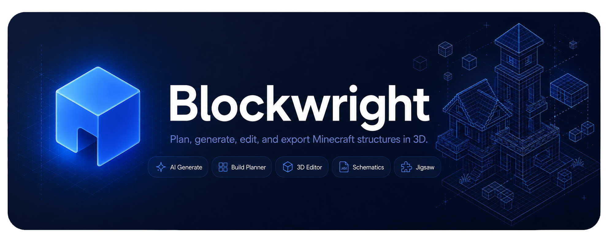
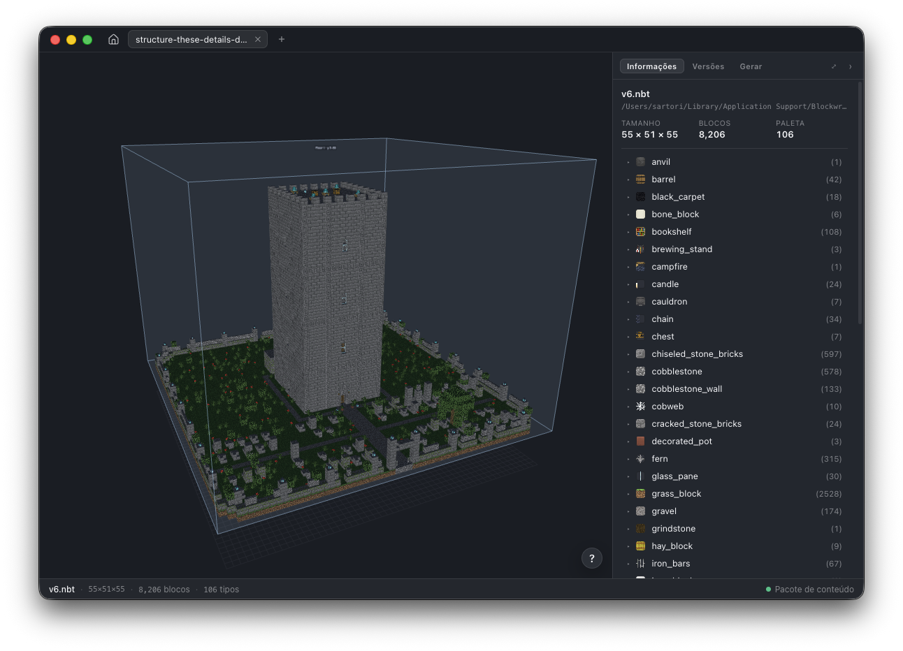
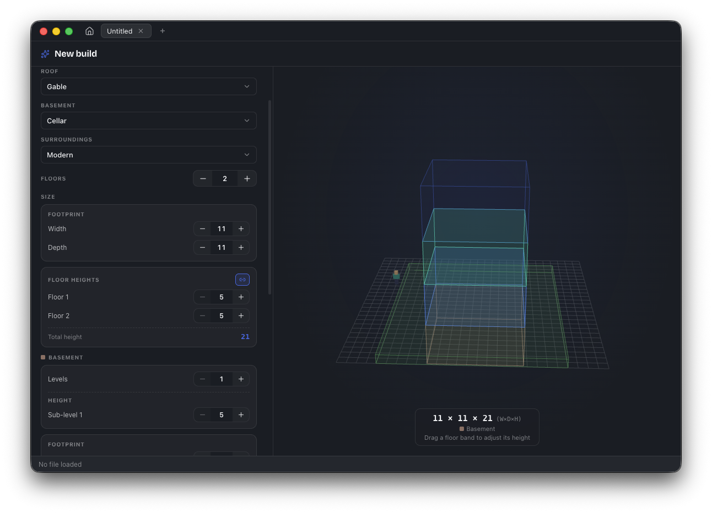

<p align="center">
  
</p>

<h1 align="center">Blockwright</h1>

<p align="center">
  A desktop app for viewing, editing, comparing, and AI-generating Minecraft structures and
  worlds in 3D.
</p>

<p align="center">
  <a href="https://www.electronjs.org"></a>
  <a href="https://threejs.org"></a>
  <a href="https://www.typescriptlang.org"></a>
  <a href="./LICENSE"></a>
  <a href="https://buymeacoffee.com/mattsartori"></a>
</p>

<p align="center">
  <a href="#features">Features</a> ·
  <a href="#getting-started">Getting Started</a> ·
  <a href="#usage">Usage</a> ·
  <a href="#mod-workspaces">Mod Workspaces</a> ·
  <a href="#development">Development</a> ·
  <a href="#architecture">Architecture</a> ·
  <a href="#support">Support</a>
</p>

<p align="center">
  
</p>

<p align="center">
  
</p>

Blockwright loads Minecraft `.nbt` structures (plus WorldEdit `.schem` and Litematica
`.litematic` schematics) and renders them as interactive 3D scenes with the real block models and
textures from your own Minecraft content pack — modded blocks included. It opens whole **world
saves** the same way, and edits them through a safe write path (session lock, enforced backups,
atomic region writes). It can also **AI-generate** structures from a prompt, refining them through
a visual emit → render → review loop, and gives you the studio tools around them: an in-viewer
block editor, a visual diff, one-click re-theming, showcase renders, a jigsaw/worldgen authoring
workbench, and a full mod-workspace export pipeline.

## Features

- **Real-time 3D rendering** of `.nbt`, `.schem` and `.litematic` structures, with block entities
  (chests, beds, banners…), animated fluids, and a Block Catalog with live 3D previews
- **Every vanilla mob, as its real model** — ~80 entities (creepers, wolves, villagers, horses, the
  warden, the ender dragon) drawn in both the structure viewer and the streamed world, textured
  from your content pack and honoring their NBT: wolf coats, horse colors, sheep wool dyed and
  sheared, villager biome + profession overlays, babies at half scale, glowing-eye layers — plus
  armor stands in their real pose, and item frames and chest contents carried when you place a
  build into a world
- **AI structure generation** from a prompt or reference image, refined through an
  emit → render → review loop — on your existing **Claude** (Pro/Max) or **Codex** (ChatGPT
  Plus/Pro) subscription, no API credits, with Saver/Balanced/Thorough cost presets
- **Composable build planner** — pick a structure type (House / Tower / Church families, each with
  a guaranteed code-built shell), decoration, roof, basement, attic, yard and per-floor rooms, with
  live 3D previews in the Module Gallery
- **In-app block editor** — select, move, mirror/rotate, extrude, paint, replace, delete and edit
  air/void directly in the viewer: live symmetry, plane-locked strokes, depth targeting for
  multi-layer void regions, magic select (one click takes a whole connected region, down to a
  same-family tolerance that grabs stone + bricks + their stairs and slabs), percentage paint
  patterns (`50% stone, 30% andesite, 20% gravel`), number-key tool shortcuts, undo/redo, and
  orientation that stays correct on every transform; each save is a new version
- **Structure Diff** — compare the open build with any file or any of its versions: added, removed
  and changed cells marked in the viewer with a per-block summary. "What did this AI run change?"
  is one click
- **Re-theme** — swap blocks across the whole build with blockstates carried over (stairs keep
  their facing), by hand or from any registered decoration — "download any build, make it yours"
- **Beauty Render** — export a high-resolution PNG (transparent or themed background, preset
  angles including a cross-section) or a turntable WebM, straight from the viewer
- **World viewer** — fly through a whole Minecraft save (1.13+): streamed chunks with
  level-of-detail, minimap with slime chunks, day/night, dimension switcher (server saves and 26.x
  layouts included), waypoints, cursor readout, find-blocks search, find-structures search, and a
  Y-slice that cuts the world open so you can browse caves and basements like a doll's house
- **World editor with a safe write path** — paint, erase, box- or magic-select and fill/delete real
  terrain, **place** any open build into the world as an orientation-correct ghost, and **extract**
  a region back out as an editable tab or a `.nbt`/`.schem`/`.litematic`. Placement can blend into
  the terrain it lands on: foundation pillars down to the ground, a feathered ring, excavation of
  terrain poking through, and sunken basements. Writes are gated, never best-effort — session lock
  held, every touched region backed up, chunk NBT surgically patched (mod data survives
  byte-for-byte), regions rewritten atomically, and any chunk that fails a check refused. Worlds
  open read-only until you turn editing on in Settings ▸ World
- **Materials panel** — roll any build up into a gatherable bill of materials with stack and
  shulker-box math (doors and beds counted once, double slabs twice, fluids as buckets, entities
  included), exportable as CSV or JSON
- **Mod workspace pipeline** — render modded structures with their own textures, generate with the
  mod's own blocks, and export version-correct `.nbt`s plus the worldgen JSON that makes them
  spawn in-world. The **Worldgen Doctor** audits the whole data pack for silent failures (missing
  `spawn_overrides`, empty biome tags, dead pools…) with one-click fix-its, and **watch mode**
  hot-reloads the viewer when external tools edit your files
- **Jigsaw Lab, Worldgen Studio and Structure Lint** — the JSONs you used to edit by hand became
  panels: connector arrows and template-pool inspection in 3D with multi-seed simulation, validated
  forms over the four worldgen files (surgical writes — `spawn_overrides`, processors and salt
  survive byte-for-byte) with a live placement map, and a per-file linter that catches
  air-on-the-boundary, blocks your target version doesn't know, and orphaned palette entries
- **Version travel for data packs** — upgrade a whole workspace to its target Minecraft version, or
  **downgrade copies** to an older one: DataVersions re-stamped surgically, renamed block ids
  restored, missing blocks swapped for curated same-shape stand-ins, and every change and loss
  reported. Originals are never touched
- **Oversized builds auto-split to jigsaw** — anything past the Structure Block limit is cut into a
  jigsaw assembly that reassembles voxel-perfectly in-world; **Export to World** installs a
  ready-to-run datapack and hands you the `/place` command
- **Round-trip in-game editing** — export into a world, edit with vanilla Structure Blocks, then
  **Reimport from World** stitches the result back as a new version
- An IDE-style workbench with a theme gallery, versions panel, floor-plan bands, structure library,
  and an interface in **English and Português (Brasil)**
- **Current with Minecraft's release cadence, through 26.2** — year-numbered versions detect,
  26.x worlds open, and exports stamp the DataVersion / pack format your mod (or the target
  world's `level.dat`) actually targets

## Getting Started

**Downloads** — installers for macOS, Windows and Linux are attached to each
[GitHub Release](https://github.com/matheussartori/blockwright/releases). Builds are ad-hoc
signed (no paid certs yet), so the first launch shows an OS warning:

- **macOS** — right-click ▸ **Open**. If it says the app *"is damaged"*, clear the quarantine
  flag: `xattr -dr com.apple.quarantine /Applications/Blockwright.app`
- **Windows** — **More info ▸ Run anyway**. The Squirrel installer installs per-user silently and
  auto-updates from new releases.
- **Linux** — install the `.deb`/`.rpm`, or the `.flatpak` bundle (add the Flathub remote once so
  its runtime resolves, then `flatpak install --user io.github.matheussartori.Blockwright_*.flatpak`).

**Content pack** — Blockwright renders with the textures/models of a Minecraft content pack it
does **not** bundle (Mojang's assets can't be redistributed). Extract a version's `assets` and
`data` folders (from the `.jar` in `.minecraft/versions/<version>/`) into one folder and pick it in
**Settings ▸ Viewer ▸ Content pack**. Without one, blocks render as flat colors — everything else
still works.

## Usage

- **Open a structure** — **File ▸ Open…** with a `.nbt`, `.schem` or `.litematic`; orbit and
  inspect it in 3D. **Export As…** converts between the three formats.
- **Explore a world** — **File ▸ Open World…** on a save folder; **F** to fly, **WASD** to move.
  Chunks stream with LOD; jump to spawn, coordinates, a waypoint or any generated structure, and
  `[` / `]` slice the world down to browse underground.
- **Edit a world** — turn editing on in **Settings ▸ World** (worlds open read-only), then **Edit**
  on the world stage: paint/erase, box or magic select, fill and delete, with undo/redo. Nothing
  touches the disk until **Save to World**, whose dialog previews the blocks, chunks and backup
  first. Close Minecraft before saving — the session lock will tell you if you didn't.
- **Place & extract** — drop the open build into the world as a ghost (arrows/PgUp/PgDn to nudge,
  **R** to rotate, terrain blend on the place panel), or box-select a region and take it out as a
  new tab or a schematic file.
- **Generate** — **File ▸ New Structure** opens the Build Planner: describe the build, pick the
  modules (structure/decoration/roof/basement/attic/yard/per-floor rooms + per-floor heights), and
  watch it evolve live. Follow-up edits continue in the chat; every build lands in a browsable
  library folder with its versions and a generation log. Pick a provider in **Settings ▸ AI** first.
- **Edit** — click **Edit** on the stage. Tools live on a rail (keys 1–9), every control has a
  tooltip, and an on-canvas hint shows what a click will do. Paint with brush/recolor/fill and an
  eyedropper (Alt+click), mirror with live symmetry, reveal and edit air/void layers (Alt+scroll
  aims deeper), and save as a new version — undo has your back throughout.
- **Compare** — **File ▸ Compare with File…**, or the compare action on any entry in the Versions
  panel. Green = added, red = removed, yellow = changed block/state.
- **Re-theme** — **File ▸ Re-theme Structure…**: map blocks by hand (with occurrence counts) or
  apply a decoration's whole palette; blockstates are preserved. Undoable, saved as a version.
- **Render** — **File ▸ Render Image…** for a high-res PNG or a turntable WebM.
- **Versions** — each AI run and manual save is one version. Preview any, **Set as Current** to
  branch from it, compare, or delete old ones.
- **Inspect** — the dock panels under **View**: Inspector, **Materials** (bill of materials),
  **Jigsaw** (connectors, pools, seed simulation), **Worldgen Studio** (the four worldgen JSONs)
  and **Structure Lint** (per-file checks — clicking a finding focuses the cell in 3D).

## Mod Workspaces

A **mod workspace** points Blockwright at a mod project so its assets resolve: **File ▸ Open Mod
Workspace…**, and the mod's structures render with their custom textures (pin the workspace to
auto-activate it at launch). Opening a loose `.nbt` that lives inside a mod offers to activate it.

- **Generate with the mod's blocks** — annotate the useful blocks in the **Block Catalog** (the
  dictionary travels with the mod), then set the planner's **Mod blocks** control to Off / Mix /
  **Prefer** (the code-built shell itself compiles in the mod's materials).
- **Export to Mod Workspace…** writes the `.nbt` into the version-correct structure folder and,
  optionally, the four worldgen JSON files that make it spawn (structure def, template pool,
  structure set, biome tag) — with every file and problem previewed before writing. Oversized
  builds are split into a jigsaw assembly automatically.
- **Export to World…** installs a ready-to-run datapack into a save and shows the `/place`
  command; edit in-game with Structure Blocks and **Reimport from World** to round-trip.
- **Tune the worldgen without leaving the app** — the **Worldgen Studio** panel edits terrain
  adaptation, size, max distance, biomes, spacing/separation and start-pool weights with live
  validation, and the **Jigsaw** panel re-simulates the assembly right after you save, so the loop
  is edit → save → re-simulate → see it in 3D.
- **Workspace Check-Up…** (the Worldgen Doctor) scans the whole data pack and explains every
  silent failure it finds — before you launch the game, with **Fix it** buttons on the safe ones,
  plus **Upgrade** to the workspace's target version and **Downgrade copies…** to an older one.
  Watch mode keeps the viewer and the project panel in sync with external edits (a datapack build,
  an Axiom export, VS Code).

## Development

```bash
git clone https://github.com/matheussartori/blockwright.git
cd blockwright
npm install
npm start   # Vite dev server + Electron, with HMR
```

| Command             | Description                                       |
| ------------------- | ------------------------------------------------- |
| `npm run lint`      | Run ESLint (typescript-eslint)                    |
| `npm run typecheck` | Type-check with `tsc --noEmit`                    |
| `npm run test`      | Run the Vitest unit suites                        |
| `npm run package`   | Package the app via Electron Forge                |
| `npm run make`      | Build distributable installers via Electron Forge |

**Packaging notes** — releases are built in CI (`.github/workflows/release.yml`, on a `v*` tag).
Locally: use **Node 22** (Forge's packaging silently breaks on 26); macOS is ad-hoc signed unless
you set `APPLE_SIGNING_IDENTITY` (+ `APPLE_ID`/`APPLE_PASSWORD`/`APPLE_TEAM_ID` to notarize); the
Flatpak maker needs `flatpak`, `flatpak-builder` and the pinned **24.08** freedesktop/Electron
runtimes (see `forge.config.ts`).

**Updates** — auto-install via update.electronjs.org where Squirrel can (Windows, signed macOS),
plus a notify-only GitHub-release check everywhere else. `BW_FORCE_UPDATE_CHECK=9.9.9` fakes a
newer release for testing.

**Headless screenshots** — the app can capture itself for visual verification:

| Variable                | Description                                                        |
| ----------------------- | ------------------------------------------------------------------ |
| `BW_OPEN` / `BW_OPEN_WORLD` | Open a structure file / world folder on startup                |
| `BW_CAPTURE`            | Write a PNG after rendering, then quit                             |
| `BW_CAPTURE_DELAY`      | Capture delay in ms (raise on cold starts)                         |
| `BW_CONTENT` / `BW_WORKSPACE` | Override the content pack / activate a workspace             |
| `BW_WORLD_CAM` / `BW_WORLD_LOOK` | Initial world camera position / look target (`x,y,z`)     |
| `BW_OPEN_SETTINGS`      | Open Settings on a tab (`viewer`, `world`, `ai`, `library`…)       |
| `BW_OPEN_PANEL`         | Focus a dock panel (`jigsaw`, `worldgen`, `lint`, `materials`…)    |

## Architecture

Three Vite bundles, one per Electron context, with a strict process boundary — **no Node / `fs` /
`electron` imports in the renderer**; everything crosses via IPC.

```
src/
  main.ts        Main entry: app lifecycle, open-file, scheme/protocol/IPC wiring
  preload.ts     Exposes window.blockwright (contextBridge) — the only renderer→main bridge
  main/          Window, IPC handlers, native menu, workspaces, structure loading, the
                 authoring/NBT compiler, the generation domain, AI generation, exports
                 (workspace/world/jigsaw split, up/downgrade), the Worldgen Doctor and Studio,
                 the structure linter, watch mode, and the Anvil world reader + safe write path
  renderer/      React UI shell, the imperative Three.js viewer (+ overlays: diff, voids,
                 symmetry, connectors), the pure diff/editing ops, and the streamed world
                 view/editor
  shared/        IPC channel names, type-only contracts, generated entity models, and pure
                 domain logic shared by both
knowledge/       AI knowledge base (NBT authoring guides), shipped as an extraResource
content/         A user-supplied Minecraft content pack (dev-only auto-pickup; not bundled)
```

- **IPC** — `shared/ipc.ts` is the single source of truth for channel/event names.
- **Content pack** — asset resolution is namespace-aware; textures are served only through the
  privileged `bw-texture://` scheme.
- **Renderer state** — vanilla [Zustand](https://github.com/pmndrs/zustand) stores.
- **World writes** — every mutation goes through `main/world/edit/`: session lock, enforced
  region-granular backup, surgical NBT patch, atomic rewrite, POI invalidation, refuse-on-failure.
  The renderer never writes to a save.

Built with **Electron Forge + Vite + TypeScript + React + Three.js**.

## Support

Blockwright is a solo, open-source project. If it's useful to you and you'd like to help fund its
continued development, consider buying me a coffee — every bit is genuinely appreciated. ☕

<p align="center">
  <a href="https://buymeacoffee.com/mattsartori">
    
  </a>
</p>

## License

[MIT](./LICENSE) © [Matheus Sartori](https://github.com/matheussartori)
